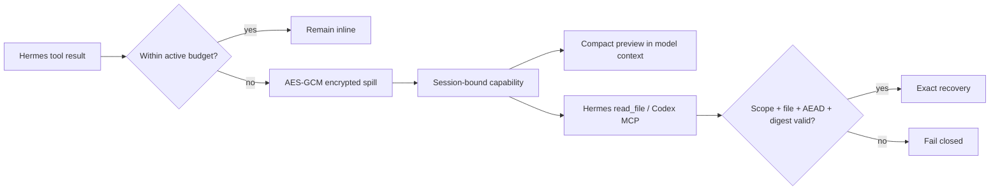

# HERMES HARNESS

> **More usable context. Fewer wasted tokens. Exact recovery. Native to Hermes.**

**HERMES HARNESS is an improved, Hermes-native adaptation of DeepSeek Harness—selectively integrating its strongest ideas with capabilities already native to Hermes.**

It is not a repackaging of the DeepSeek Harness runtime. We studied DSH as a design source, measured its useful mechanisms against Hermes, rejected duplicated or weaker layers, and implemented the surviving ideas directly at Hermes Agent's native model-facing tool boundary.

[](#current-status)
[](LICENSE)
[](https://github.com/NousResearch/hermes-agent/pull/89582)

## Why it exists

Agent sessions waste context when large terminal logs, searches, web extractions, and generated outputs are repeatedly sent back to the model. Naive truncation saves tokens but destroys evidence. HERMES HARNESS takes a different path:

1. keep normal results inline;
2. move oversized results out of immediate model context;
3. retain a compact preview;
4. encrypt the complete payload;
5. return an opaque, session-bound recovery capability;
6. recover exact bytes only when the originating session needs them.

## What is implemented

- Central model-facing tool-result budgeting
- Context-window-scaled per-result and per-turn budgets
- Compact inline previews for oversized output
- AES-GCM authenticated encryption at rest
- Opaque `hermes-spill://v1/...` recovery capabilities
- Same-session recovery and cross-session denial
- Recovery through Hermes `read_file` and Codex MCP
- Session propagation through nested `execute_code` RPC
- Symlink, reparse-point, FIFO/device, ownership, mode, digest, and AEAD validation
- Cleanup and upgrade-regression monitoring

## Why this is Hermes-native

HERMES HARNESS uses structures Hermes already owns:

- the existing `tools/tool_result_storage.py` persistence stack;
- Hermes session identity and tool execution boundaries;
- the native `read_file` path;
- Codex MCP transport;
- `execute_code` RPC propagation;
- Hermes gateway lifecycle and cleanup.

That avoids introducing a second runtime, event store, plugin kernel, or web application.

## What it does not include

HERMES HARNESS does **not** install or run:

- the external DeepSeek Harness runtime;
- Cordis;
- the DSH web application;
- SurfaceOp;
- DSH AST Code Mode.

“DeepSeek Harness” and “DSH” refer only to research provenance. The Hermes-native product name is always **HERMES HARNESS**.

## Current status

**Research preview / upstream proposal.** The capability layer is running in a private Hermes Studio deployment and has been proposed upstream in [NousResearch/hermes-agent#89582](https://github.com/NousResearch/hermes-agent/pull/89582). It is not yet part of an official Hermes Agent release.

Do not treat this repository as a one-command installer. Until the upstream contribution is merged or a supported extension boundary exists, use the patch only in an isolated Hermes Agent development checkout and review the diff before applying it.

## Verification evidence

The reviewed implementation commit is:

```text
d0155e2c83011ef0ed7b5b1d39bf2640c3daa5dc
```

Focused verification recorded on those bytes:

- 152 tests plus 7 subtests: capability/storage, Codex MCP, execute-code, persistence
- 57 tests: Codex app-server runtime and context tracking
- 9 tests: dispatch session identity and transform hooks
- 1 focused capability-specific `read_file` test
- independent Gemini 3.7 Flash High review: **GO, no release blockers**

A live default-policy canary moved a 120,024-byte result out of immediate context, recovered it byte-identically in the same session, rejected a different session, confirmed ciphertext at rest, and cleaned the artifact afterward.

These results establish functional and security behavior. They do **not** yet justify a universal percentage claim for token savings. Public multi-workload benchmarks are on the roadmap.

## Architecture



## Study and reproduce

- [Canonical scope and naming](HERMES_HARNESS.md)
- [Knowledge-base index](KNOWLEDGE_BASE_INDEX.md)
- [Historical decision record](FINALIZATION.md)
- [Upgrade-permanence model](evidence/PERMANENCE.md)
- [Independent final review](evidence/upstream/FINAL_REVIEW_GEMINI_3_7_FLASH_HIGH.md)
- [Frozen upstream patch](evidence/upstream/0001-bind-persisted-results-to-session-capabilities.patch)
- [Roadmap](ROADMAP.md)

## Contributing

Read [CONTRIBUTING.md](CONTRIBUTING.md). High-value contributions include reproducible token-economy workloads, security review, Windows reparse-point coverage, transport tests, documentation, and upstream-compatible design work.

## Security

Do not post suspected vulnerabilities in public issues. Follow [SECURITY.md](SECURITY.md).

## License and provenance

HERMES HARNESS is released under the [MIT License](LICENSE). See [NOTICE.md](NOTICE.md) for provenance and naming boundaries.
